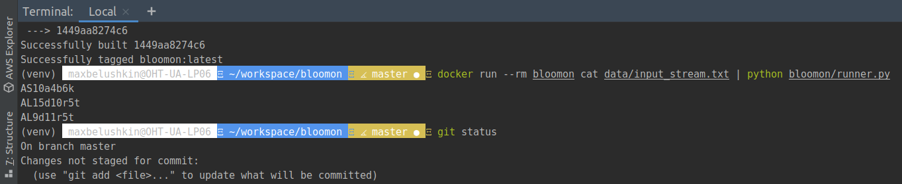

# Bloomon python assessment

Bloomon has a production facility that produces bouquets. We simplified how the real one - located in Amstelveen - works, for the purpose of this
technical challenge

Your job is to create an application that takes the bouquet designs and the stream of flowers as an input, and produce the stream of bouquets as
an output.

## Requirements of the assessment:

The application needs to be a command line application using standard input and output.
It can be written in any of the following languages: Python, Ruby, Go, JavaScript, TypeScript, PHP.

The solution should be submitted in a GitHub / GitLab repository, with full source code and configuration files to build and run it in a Docker
container.

## Source code and execution result of the application



## Ways to improve the application
Application was designed under the pressure of time and can be optimized in different ways.
First of all we have to decide do we consume all flowers and then produce bouqets or we produce bouqets
on the fly.

I don't see at the moment how we can optimize storage of the designs, we should walk over the list and check
do we have enough flowers per every design. This is inefficient and can be optimized but I don't see clear
solution at the moment. Probably we can store designs using TRIE datastructure or use another binary tree
implementation

Maintaining total amount of flowers both small and large can be improved either distinction between what
kind of design do we have at the moment. Because current implementation produces huge if conditions and it
looks ugly.

Implementing reminder of the bouqet name must be improved as well. I think about maintaining priority queue
with dictionary keys as flower specie and values as amount of left flowers large or small. Keeping it sorted
will reduce amount of dict walking in order to fulfill left flowers in the bouqet.

## Technologies used in the assessment
- Python 3.8
- Docker
- Linux Ubuntu

## Prerequisites
Docker.io must be installed in the system in order to be able to use the app. OS Linux

## How to setup the application:
```shell script
git clone https://github.com/belushkin/bloomon.git;
cd bloomon;
docker build -t bloomon .
```

## How to run tests
```shell script
docker run --rm bloomon python -m pytest
```

## Basic script usage:
```shell script
docker run --rm bloomon cat data/input_stream.txt | python bloomon/runner.py
```

## Contributors
@belushkin

## License
MIT